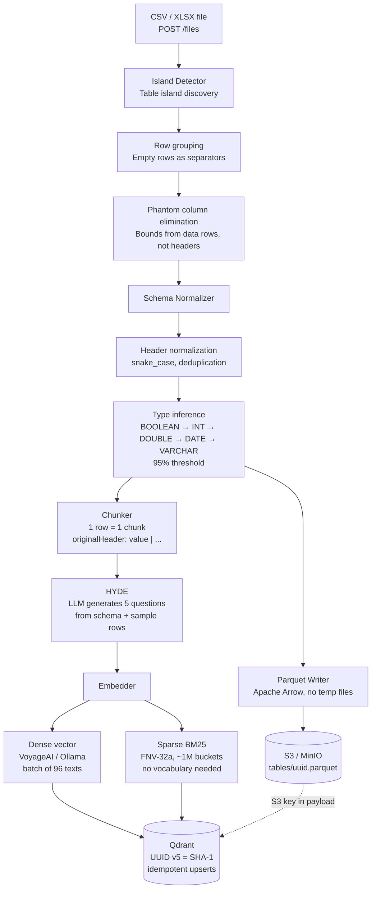
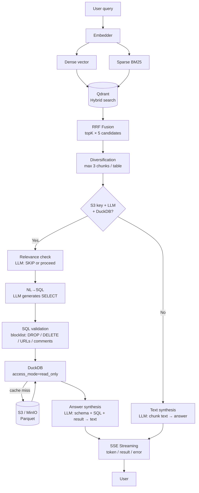

# Teaching LLMs to Work with Tables: Inside a RAG System for CSV and Excel

Most articles about RAG tell roughly the same story: split text into chunks, create embeddings, put them into a vector store, retrieve the most similar ones, pass them to an LLM. Clean, simple, obvious. Until you try to do the same thing with tables.

Tables are a different world. Rows don't read linearly. Data is organized by columns. A single Excel file can contain five unrelated tables on one sheet. And then there are merged cells, "phantom" columns, totals in headers, and date formats like "February 14th, 2024." This is what you deal with in real projects.

In this article, I'll walk through the architecture of a Table RAG system written in Go that addresses all of these problems. We'll trace two key paths: data ingestion and query processing. Each has its own non-trivial design decisions worth examining closely.

---

## Part I. The Data Ingestion Pipeline

When a user uploads a CSV or XLSX file, the system's job isn't simply to "read the data" — it needs to understand the structure: where each table starts and ends, which rows are headers, what data types are present, and how to index everything for efficient retrieval later.

### Step 1. Island Detection

The most non-trivial part of the ingestion pipeline is the island detection algorithm (`islands/detector.go`). Picture a typical Excel report: company logo at the top, an empty row, a sales table, another empty row, and a budget table placed beside it. All on one sheet.

A naive approach reads the entire sheet as a single table and produces garbage. The correct approach finds each "island of data" separately.

The algorithm works in two passes:

**First pass — row grouping.** Scan the sheet from top to bottom. Completely empty rows act as separators. Contiguous groups of non-empty rows form candidate tables.

**Second pass — column boundary detection.** This is where things get interesting. For each row group, the system needs to determine which columns belong to it. The rule "from first non-empty to last non-empty column" doesn't work, for one reason: Excel.

When you format cells or work with a sheet, Excel "touches" columns. As a result, the file technically contains data in 16,384 columns (the xlsx maximum), even though real data may span only ten. Without filtering this out, every chunk would contain thousands of empty columns.

The solution is elegant: a "phantom" column is one that has a header but zero data rows with actual content. The algorithm looks specifically at data rows (excluding the header), finds the leftmost and rightmost columns with real content — and everything outside that range is discarded.

Additionally: completely empty columns within the detected range serve as separators between side-by-side tables. This is how the algorithm discovers tables placed next to each other on the same sheet.

### Step 2. Schema Normalization

Once the islands are found, normalization begins. Two tasks: normalize headers into a consistent form, and infer column data types.

**Header normalization** follows simple rules: excess whitespace is trimmed, non-alphanumeric characters become `_`, duplicates get suffixes `_2`, `_3`, and so on, and empty headers become `col_1`, `col_2`. Original column names are preserved in metadata — this matters because those are the names the LLM will see in the chunks.

**Type inference** works on a "sufficient majority" principle. The algorithm iterates over all values in a column and tries each type in descending specificity: BOOLEAN → INTEGER → DOUBLE → DATE → TIMESTAMP → VARCHAR. A type is accepted if 95% of non-empty values match it. If nothing fits — VARCHAR.

An interesting detail in numeric parsing: the algorithm handles `$1,234.56`, `€ 99.99`, `45%`, and similar formats. Currency symbols, percent signs, thousand separators — all stripped before parsing. This matters for financial tables, where numbers almost never arrive "clean."

For dates, roughly a dozen formats are supported: ISO (`2024-01-14`), European (`14.01.2024`), US (`01/14/2024`), named months (`14 Jan 2024`), and others. This removes one of the biggest headaches with real-world data — guessing date formats.

### Step 3. Parquet Storage and S3

After normalization, data is serialized to Parquet format and uploaded to S3 (or MinIO for local deployments).

Technically, this is implemented without temporary files: Apache Arrow writes Parquet directly into an in-memory buffer, which then streams to S3. Each table gets a UUID key in the form `tables/{uuid}.parquet`. This key is saved in Qdrant metadata — it's how the system will lazily load data when executing SQL queries later.

Data types are carefully mapped during serialization: dates are encoded as days since the Unix epoch (DATE32), timestamps in microseconds UTC (TIMESTAMP_US), and NULL values are placed wherever value parsing failed.

### Step 4. HYDE and Chunk Generation

Here begins the most non-obvious design decision in the entire ingestion pipeline.

**HYDE** (Hypothetical Document Embeddings) is a technique where, before indexing, an LLM generates hypothetical questions that a user might ask about the data. For each table, the system shows the LLM the schema and up to 20 rows of data, and asks it to generate five realistic questions.

Why bother? Because the distance between a "user's query" and a "table row" in embedding space can be large. The user asks `"how much was sold in Q3"`, but the table contains `"Q3: 1,243"`. HYDE bridges the gap: the generated questions are added to chunk metadata and influence their semantic representation during search.

**Chunk generation** follows the "one row = one chunk" principle. This is a non-obvious choice. Most RAG systems use sliding windows over text, but for tables that works poorly: if you combine multiple rows into one chunk, you can't precisely localize the answer during retrieval.

Each chunk is a row formatted as `"OriginalHeader1: value1 | OriginalHeader2: value2 | …"`. Empty values are omitted. Original (non-normalized) column names are used — this makes the text more readable for the embedding model.

### Step 5. Dual Vectors

Each chunk is indexed with two types of vectors.

**Dense vectors** — standard semantic embeddings. The system supports multiple providers: VoyageAI (voyage-3, 1024 dimensions), OpenAI-compatible endpoints (Ollama, vLLM), and others. Batching: 96 texts at a time (slightly below VoyageAI's limit of 128, with a safety margin).

**Sparse vectors** — a BM25-style representation for exact keyword search. Implemented without external dependencies:

1. Tokenization: string → lowercase → split on non-alphanumeric characters → drop tokens shorter than 2 characters
2. Frequency count: TF (term frequency) of each token
3. Hashing: FNV-32a of the token string, modulo 2²⁰ (~1 million buckets)

Hash collisions are possible, but with a million buckets the probability is negligible. The approach requires no global vocabulary and no pre-training — everything is computed locally.

### Step 6. Deterministic Identifiers

Each chunk in Qdrant receives a UUID computed as `SHA-1` of the file path, sheet name, table index, and row index.

This is a small but important detail: re-uploading the same file updates the same points in the vector database rather than creating duplicates. The pipeline is idempotent by default — no additional deduplication logic needed.

---

## Part II. The Query Processing Pipeline

Once data is loaded, the second part of the story begins. The user asks a question — and the system must find relevant rows, decide how to work with them, and produce an answer.

### Step 1. Hybrid Search

The user's query is first vectorized in the same two ways: dense embedding + sparse BM25. Both vectors are sent to Qdrant for parallel search.

Results are merged using **RRF (Reciprocal Rank Fusion)** — an algorithm for combining ranked lists. Each document is assigned score = Σ 1/(rank + k) across all lists, where rank is its position in a given list and k is a smoothing constant. Documents ranked well in both lists receive a high final score, even if they weren't first in either.

Why hybrid search? Because tables frequently contain specific values: names, codes, part numbers. If a user searches for `"order #A-2847"`, semantic search may not find an exact match — but BM25 will. Conversely, a question like `"where was revenue highest"` is handled well semantically but poorly by keywords alone.

### Step 2. Result Diversification

After search, the system has, say, 50 candidates (topK × 5). These need to be filtered down to topK, but intelligently: if all the best chunks come from a single table, the user gets a one-sided answer.

The diversification algorithm is simple: one pass over sorted candidates, maximum 3 chunks per unique table. Score ordering is preserved throughout — this matters because the candidate ranking already encodes relevance information from Qdrant.

### Step 3. Two Paths to an Answer

Here the architecture branches. For each set of retrieved chunks, the system chooses one of two approaches:

The **SQL path** activates when chunks contain an S3 reference (meaning the table is fully stored as Parquet) and both LLM and DuckDB are available. This is the primary, "smart" path.

The **text path** is the fallback. Used when the SQL path is unavailable or fails. The LLM synthesizes an answer directly from the text of the retrieved chunks.

### Step 4. NL→SQL and Query Execution

The SQL path is a small system in its own right.

**For each unique table:**

1. **Relevance check.** The LLM looks at the table schema and the user's question. If the table can't answer the question, it responds with the string `"SKIP"`. This filters out tables that ended up in search results by accident.

2. **SQL generation.** The LLM receives the schema, sample rows, and the user's question, and generates a DuckDB-compatible SELECT statement. The system prompt explicitly lists column names (normalized, snake_case) and constraints: SELECT only, no modifying operations.

3. **SQL validation.** Before execution, the query passes through a blocklist. Prohibited: `DROP`, `DELETE`, `INSERT`, `UPDATE`, `CREATE`, `ALTER`, `COPY`, `ATTACH`, `PRAGMA`. File-reading functions (`read_csv`, `read_json`, `read_parquet`), URL patterns (`http://`, `s3://`), and SQL comments (`/* */`) — through which filters could theoretically be bypassed — are also stripped.

4. **Execution in DuckDB.** The Parquet file is lazily loaded from S3 and cached locally with a 15-minute TTL. DuckDB opens in `access_mode=read_only` mode — a second layer of protection after the blocklist. Even if something destructive slips through the SQL validation, the engine physically won't allow it to execute.

The DuckDB cache is an interesting solution in its own right. Loading Parquet from S3 on every query would be too slow. The cache stores already-loaded files: first query to a table — cache miss, loading takes time; all subsequent ones — cache hit, response is instant. Cache metrics (hits/misses) are available via `/metrics`.

5. **Answer synthesis.** SQL executed, result obtained. The LLM takes this result, a summary of the table, and the SQL query itself — and produces a readable natural language answer.

### Step 5. Streaming via SSE

The answer is streamed to the user token by token via Server-Sent Events (SSE). This is the standard for one-way streaming from server to client: lighter than WebSocket, requires no special libraries, works over plain HTTP.

Three event types: `token` (individual words during generation), `result` (final answer), `error` (something went wrong).

One implementation detail worth noting: when the server shuts down (SIGTERM), the base HTTP server's context is cancelled immediately. All active SSE streams receive a cancellation signal and terminate cleanly — no hanging, no waiting for a timeout. This is called graceful shutdown, and implementing it correctly is slightly trickier than it sounds.

---

## Takeaways

If you're building a RAG system for tabular data, here are the key lessons from this architecture:

**Table detection is a separate task.** Don't assume file = one table. Real Excel files are more complex, and without an explicit island-detection algorithm you'll end up with garbage chunks.

**One chunk = one row.** For tables, this works better than sliding windows. A row can be precisely localized; a group of rows cannot.

**HYDE improves recall.** Generating hypothetical questions before indexing is a cheap operation (one LLM call per table) that noticeably improves search for non-obvious queries.

**Hybrid search is non-negotiable.** Tables contain too many specific values (codes, names, numbers) that semantic search handles poorly on its own.

**SQL is powerful, but needs guardrails.** NL→SQL delivers precise, verifiable answers. But you need layered controls: blocklist + read-only engine + explicit constraints in the prompt.

**Deterministic identifiers = idempotency.** A small detail that prevents big problems during re-indexing.

---

The Table RAG architecture shows that "just add tables to your RAG" is fundamentally the wrong approach. Every stage requires specialized solutions: from structure detection to dual indexing and secured SQL execution. It's these details that make the difference between a system that works on real data and one that only works on the clean examples in textbooks.
