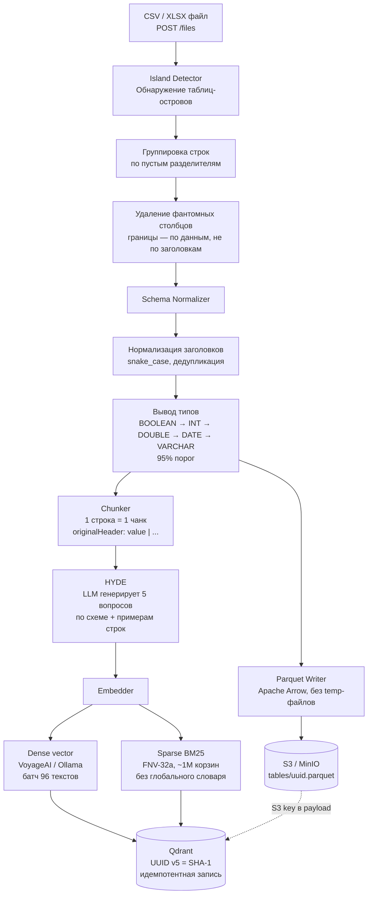
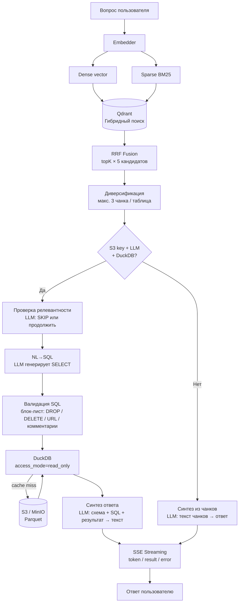

# Как научить LLM работать с таблицами: внутренности RAG-системы для CSV и Excel

Большинство статей про RAG рассказывают примерно одно и то же: разбей текст на чанки, сделай эмбеддинги, положи в векторную базу, достань похожее, отдай в LLM. Красиво, просто, понятно. До тех пор, пока вы не попробуете сделать то же самое с таблицами.

Таблицы — это другой мир. Строки не читаются линейно. Данные структурированы по столбцам. Один Excel-файл может содержать пять несвязанных таблиц на одном листе. А ещё там бывают объединённые ячейки, «фантомные» столбцы, суммы в заголовках и форматы дат вроде «14 февраля 2024». Именно с этим приходится работать в реальных проектах.

В этой статье я разберу архитектуру системы Table RAG, написанной на Go, которая решает все эти проблемы. Мы пройдём два ключевых пути: загрузку данных и обработку запроса. В каждом — свои нетривиальные решения, которые стоит рассмотреть отдельно.

---

## Часть I. Пайплайн загрузки данных

Когда пользователь загружает CSV или XLSX-файл, система должна не просто «прочитать данные», а понять структуру: где здесь таблица, где заголовки, какие типы данных, и как всё это потом эффективно искать.

### Шаг 1. Обнаружение островов

Самая нетривиальная часть пайплайна — это алгоритм обнаружения «островов» (`islands/detector.go`). Представьте типичный Excel-отчёт: сверху — логотип компании, под ним — пустая строка, потом таблица с продажами, снова пустая строка, рядом — ещё одна таблица с бюджетом. Всё это на одном листе.

Наивный подход прочитает весь лист как одну таблицу и получит мусор. Правильный — найдёт каждый «остров данных» отдельно.

Алгоритм работает в два прохода:

**Первый проход — группировка по строкам.** Сканируем лист сверху вниз. Полностью пустые строки — это разделители. Непрерывные группы непустых строк образуют потенциальные таблицы.

**Второй проход — определение границ столбцов.** Вот здесь начинается интересное. Для каждой группы строк нужно понять, какие столбцы к ней относятся. Правило «от первого непустого до последнего непустого» не работает по одной причине: Excel.

Когда вы форматируете ячейки или работаете с листом, Excel «трогает» столбцы. В результате файл технически содержит данные в 16 384 столбцах (максимум для xlsx), хотя реальных данных — в десяти. Если не отфильтровать это, каждый чанк будет содержать тысячи пустых колонок.

Решение элегантное: «фантомный» столбец — это такой, у которого есть заголовок, но ни одной строки с данными. Алгоритм смотрит именно на строки с данными (не заголовочные), находит крайний левый и крайний правый столбец с реальным содержимым — и всё, что выходит за эти границы, отбрасывается.

Дополнительно: если внутри найденного диапазона есть полностью пустые столбцы — они рассматриваются как разделители между соседними таблицами. Так обнаруживаются таблицы, стоящие рядом на одном листе.

### Шаг 2. Нормализация схемы

После того как острова найдены, начинается нормализация. Здесь две задачи: привести заголовки к единому виду и вывести типы данных.

**Нормализация заголовков** следует простым правилам: всё лишнее пространство обрезается, не-алфавитные символы заменяются на `_`, дубликаты получают суффикс `_2`, `_3` и так далее, а пустые заголовки превращаются в `col_1`, `col_2`. При этом оригинальные названия сохраняются в метаданных — это важно, потому что именно их LLM будет видеть в чанках.

**Вывод типов** работает по принципу «достаточного большинства». Алгоритм проходит по всем значениям столбца и пробует каждый тип в порядке убывания специфичности: BOOLEAN → INTEGER → DOUBLE → DATE → TIMESTAMP → VARCHAR. Тип принимается, если ему соответствуют 95% непустых значений. Если не подошло ничего — VARCHAR.

Интересная деталь в парсинге чисел: алгоритм умеет обрабатывать `$1,234.56`, `€ 99.99`, `45%` и аналогичные форматы. Символы валют, знаки процента, разделители тысяч — всё это снимается перед парсингом. Это важно для финансовых таблиц, где числа почти никогда не приходят «чистыми».

Для дат поддерживается около дюжины форматов: ISO (`2024-01-14`), европейский (`14.01.2024`), американский (`01/14/2024`), с именованными месяцами (`14 Jan 2024`) и другие. Это снимает одну из главных болей при работе с реальными данными — угадывание формата дат.

### Шаг 3. Хранение в Parquet и S3

После нормализации данные сериализуются в формат Parquet и загружаются в S3 (или MinIO для локального развёртывания).

Технически это реализовано без временных файлов: Apache Arrow записывает Parquet прямо в буфер в памяти, который затем стримингом уходит в S3. Каждая таблица получает UUID-ключ вида `tables/{uuid}.parquet`. Этот ключ потом сохраняется в метаданных Qdrant — через него система будет лениво загружать данные при выполнении SQL-запросов.

Типы данных при сериализации аккуратно маппятся: даты кодируются как количество дней от Unix-эпохи (DATE32), временные метки — в микросекундах UTC (TIMESTAMP_US), NULL-значения расставляются там, где парсинг значения не удался.

### Шаг 4. HYDE и генерация чанков

Здесь начинается самое неочевидное решение во всём пайплайне загрузки.

**HYDE** (Hypothetical Document Embeddings) — это техника, при которой перед индексацией LLM генерирует гипотетические вопросы, которые пользователь мог бы задать по данным. Для каждой таблицы система показывает LLM схему и до 20 строк данных, и просит сгенерировать пять реалистичных вопросов.

Зачем это нужно? Потому что расстояние между «запросом пользователя» и «строкой из таблицы» в пространстве эмбеддингов может быть большим. Пользователь спрашивает `«сколько продано в третьем квартале»`, а в таблице лежит `«Q3: 1 243»`. HYDE строит мост: вопросы добавляются в метаданные чанков и влияют на их семантику при поиске.

**Нарезка на чанки** следует принципу «одна строка — один чанк». Это нетривиальное решение. Большинство RAG-систем делают скользящие окна по тексту, но для таблиц это плохо работает: если объединить несколько строк в один чанк, при поиске невозможно будет точно локализовать ответ.

Каждый чанк — это строка в формате `"OriginalHeader1: value1 | OriginalHeader2: value2 | …"`. Пустые значения опускаются. Используются оригинальные (не нормализованные) названия заголовков — это делает текст более читаемым для эмбеддинг-модели.

### Шаг 5. Двойные векторы

Каждый чанк индексируется двумя типами векторов.

**Плотные векторы (Dense)** — стандартные семантические эмбеддинги. Система поддерживает несколько провайдеров: VoyageAI (voyage-3, 1024 измерения), OpenAI-совместимые (Ollama, vLLM) и другие. Батчинг: 96 текстов за раз (чуть ниже лимита VoyageAI в 128, с запасом).

**Разреженные векторы (Sparse)** — это BM25-подобное представление для точного поиска по ключевым словам. Реализация без внешних зависимостей:

1. Токенизация: строка → нижний регистр → разбивка по не-алфавитным символам → отброс токенов короче 2 символов
2. Подсчёт частот: TF (term frequency) каждого токена
3. Хеширование: FNV-32a от строки токена, взятое по модулю 2²⁰ (~1 миллион «корзин»)

Коллизии хешей возможны, но при миллионе корзин вероятность незначительна. Зато этот подход не требует ни глобального словаря, ни предобучения — всё вычисляется локально.

### Шаг 6. Детерминированные идентификаторы

Каждый чанк в Qdrant получает UUID, вычисленный как `SHA-1` от пути к файлу, имени листа, индекса таблицы и индекса строки.

Это маленькая, но важная деталь: повторная загрузка того же файла обновляет те же точки в векторной базе, а не создаёт дубликаты. Пайплайн идемпотентен по умолчанию — никакой дополнительной логики дедупликации не нужно.

---

## Часть II. Пайплайн обработки запроса

Когда данные загружены, начинается вторая часть истории. Пользователь задаёт вопрос — и система должна найти релевантные строки, понять, как с ними работать, и сформировать ответ.

### Шаг 1. Гибридный поиск

Запрос пользователя сначала векторизуется теми же двумя способами: плотный эмбеддинг + разреженный BM25. Затем оба вектора отправляются в Qdrant для параллельного поиска.

Результаты объединяются через **RRF (Reciprocal Rank Fusion)** — алгоритм слияния ранжированных списков. Каждому документу присваивается score = Σ 1/(rank + k) по всем спискам, где rank — позиция в конкретном списке, k — константа сглаживания. Документы, хорошо ранжированные в обоих списках, получают высокий итоговый score, даже если ни в одном из них они не были первыми.

Почему именно гибридный поиск? Потому что в таблицах часто встречаются конкретные значения: имена, коды, артикулы. Если пользователь ищет `«заказ #A-2847»`, семантический поиск может не найти точного совпадения — а BM25 найдёт. И наоборот: вопрос `«где была наибольшая выручка»` хорошо обрабатывается семантически, но плохо — по ключевым словам.

### Шаг 2. Диверсификация результатов

После поиска система получает, допустим, 50 кандидатов (topK × 5). Их нужно отфильтровать до topK, но умно: если все лучшие чанки относятся к одной таблице, пользователь получит однобокий ответ.

Алгоритм диверсификации прост: один проход по отсортированным кандидатам, максимум 3 чанка с каждой уникальной таблицы. Порядок по score при этом сохраняется — это важно, потому что сортировка кандидатов уже несёт в себе информацию о релевантности.

### Шаг 3. Два пути к ответу

Здесь архитектура разветвляется. Для каждого набора найденных чанков система выбирает один из двух подходов:

**SQL-путь** активируется, если чанки содержат ссылку на S3 (то есть таблица полностью сохранена как Parquet), и доступны LLM и DuckDB. Это основной, «умный» путь.

**Текстовый путь** — запасной. Используется, если SQL-путь недоступен или завершился неудачей. LLM синтезирует ответ прямо из текста найденных чанков.

### Шаг 4. NL→SQL и выполнение запросов

SQL-путь — это маленькая система сама по себе.

**Для каждой уникальной таблицы:**

1. **Проверка релевантности.** LLM смотрит на схему таблицы и вопрос пользователя. Если ответить по этой таблице невозможно — отвечает строкой `"SKIP"`. Это фильтрует таблицы, которые попали в результаты поиска случайно.

2. **Генерация SQL.** LLM получает схему, примеры строк и вопрос пользователя, и генерирует DuckDB-совместимый SELECT. В системном промпте явно указаны имена столбцов (нормализованные, snake_case) и ограничения: только SELECT, никаких модифицирующих операций.

3. **Валидация SQL.** Прежде чем выполнять, запрос проходит через блок-лист. Запрещены: `DROP`, `DELETE`, `INSERT`, `UPDATE`, `CREATE`, `ALTER`, `COPY`, `ATTACH`, `PRAGMA`. Также фильтруются функции чтения файлов (`read_csv`, `read_json`, `read_parquet`), URL-паттерны (`http://`, `s3://`) и SQL-комментарии (`/* */`), через которые теоретически можно обойти фильтры.

4. **Выполнение в DuckDB.** Parquet-файл лениво загружается из S3 и кешируется локально с TTL 15 минут. DuckDB открывается в режиме `access_mode=read_only` — это второй слой защиты после блок-листа. Даже если в SQL пролезет что-то деструктивное, движок физически не позволит это выполнить.

Кеш DuckDB — это интересное решение само по себе. Загружать Parquet из S3 при каждом запросе было бы слишком медленно. Кеш хранит уже загруженные файлы в памяти: первый запрос к таблице — cache miss, загрузка занимает время; все последующие — cache hit, ответ мгновенный. Метрики кеша (hits/misses) доступны через `/metrics`.

5. **Синтез ответа.** SQL выполнен, результат получен. LLM берёт этот результат, суммарное описание таблицы и сам SQL-запрос — и формирует читаемый ответ на естественном языке.

### Шаг 5. Стриминг через SSE

Ответ стримится пользователю токен за токеном через Server-Sent Events (SSE). Это стандарт для односторонней потоковой передачи от сервера к клиенту: легче WebSocket, не требует специальных библиотек, работает через обычный HTTP.

Три типа событий: `token` (отдельные слова в процессе генерации), `result` (финальный ответ), `error` (что-то пошло не так).

Один нюанс в реализации, который заслуживает внимания: при завершении работы сервера (SIGTERM) контекст базового HTTP-сервера отменяется немедленно. Все активные SSE-стримы при этом получают сигнал отмены и корректно завершаются — без зависания и без ожидания таймаута. Это называется graceful shutdown, и реализовать его правильно чуть сложнее, чем кажется.

---

## Что можно взять отсюда

Если вы строите RAG-систему для табличных данных, вот главные уроки из этой архитектуры:

**Обнаружение таблиц — отдельная задача.** Не считайте, что файл = одна таблица. Реальные Excel-файлы сложнее, и без явного алгоритма обнаружения островов вы будете получать мусорные чанки.

**Один чанк — одна строка.** Для таблиц это работает лучше, чем скользящие окна. Строку можно точно локализовать; набор строк — нет.

**HYDE улучшает recall.** Генерация гипотетических вопросов перед индексацией — недорогая операция (один LLM-вызов на таблицу), которая заметно улучшает поиск по неочевидным запросам.

**Гибридный поиск обязателен.** В таблицах слишком много специфических значений (коды, имена, числа), которые семантический поиск находит плохо.

**SQL — это не страшно, но требует защиты.** NL→SQL даёт точные, верифицируемые ответы. Но нужен многоуровневый контроль: блок-лист + движок в read-only + явные ограничения в промпте.

**Детерминированные идентификаторы = идемпотентность.** Маленькая деталь, которая избавляет от больших проблем при переиндексации.

---

Архитектура Table RAG показывает, что «просто добавить таблицы в RAG» — это принципиально неверный подход. Каждый этап требует специализированных решений: от обнаружения структуры до дуального индексирования и защищённого выполнения SQL. Именно из таких деталей складывается система, которая работает на реальных данных, а не только на идеальных примерах из учебников.
